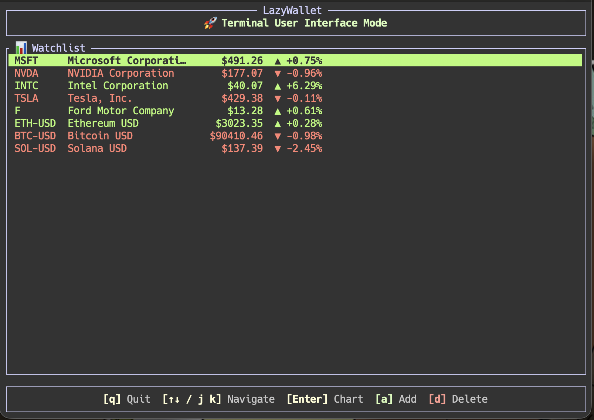
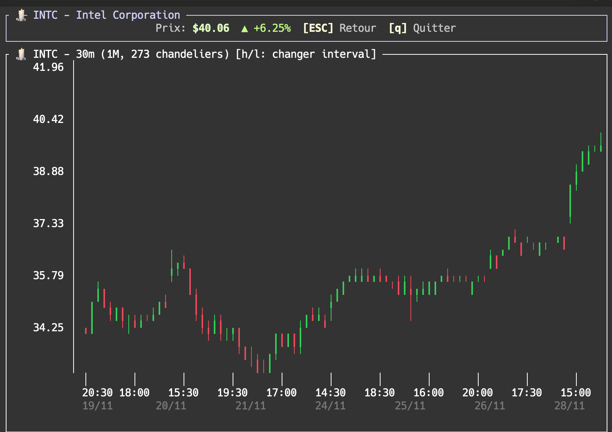

# 💼 LazyWallet

A fast, lightweight Terminal User Interface (TUI) for tracking cryptocurrency and stock prices in real-time.

## ✨ Features

- **Market Data**: Fetches prices and OHLC history from the Yahoo Finance chart API (on startup, on add, and on interval change — no periodic refresh yet)
- **Interactive Watchlist**: Track multiple tickers with daily change percentages
- **Beautiful Candlestick Charts**: Unicode-based chart visualization directly in your terminal
- **Multiple Timeframes**: Switch between 5m, 15m, 30m, 1h, 4h, 1d, and 1w intervals
- **Vim-inspired Navigation**: Efficient keyboard shortcuts for power users
- **Safe Operations**: Two-step confirmation for quit and delete actions
- **Structured Logging**: Daily-rotated log files for debugging

## 🚀 Installation

### Prerequisites

- A recent stable Rust toolchain (last verified with Rust 1.95)

### Building from Source

```bash
git clone https://github.com/cmoron/lazywallet.git
cd lazywallet
cargo build --release
```

The binary will be available at `./target/release/lazywallet`

## 📖 Usage

### Starting the Application

```bash
cargo run
# or if you built the release binary:
./target/release/lazywallet
```

The application starts with a hardcoded watchlist (`AAPL`, `TSLA`, `BTC-USD`), loaded before the UI appears. The watchlist is not persisted: tickers you add or delete are lost on exit.

### Keyboard Shortcuts

#### Dashboard (Watchlist View)

| Key | Action |
|-----|--------|
| `a` | Add a new ticker to the watchlist |
| `d` | Delete selected ticker (requires confirmation) |
| `↑` / `k` | Navigate up in the list |
| `↓` / `j` | Navigate down in the list |
| `Enter` | Open candlestick chart for selected ticker |
| `q` | Quit application (requires confirmation) |

#### Chart View

| Key | Action |
|-----|--------|
| `h` | Switch to previous interval (cycle: 5m → 15m → 30m → 1h → 4h → 1d → 1w) |
| `l` | Switch to next interval |
| `ESC` / `Space` | Return to dashboard |
| `q` | Quit application (requires confirmation) |

#### Input Mode (Adding Ticker)

| Key | Action |
|-----|--------|
| `Enter` | Confirm and add ticker |
| `ESC` | Cancel input |
| `Backspace` | Delete last character |

Accepted characters: letters, digits, `-` and `.`.

### Supported Tickers

LazyWallet supports any ticker available on Yahoo Finance:

- **Stocks**: `AAPL`, `GOOGL`, `TSLA`, `MSFT`, etc.
- **Cryptocurrencies**: `BTC-USD`, `ETH-USD`, `SOL-USD`, etc.
- **ETFs**: `SPY`, `VOO`, etc.

Forex (`EURUSD=X`) and index (`^GSPC`) symbols exist on Yahoo but cannot be typed yet (`=` and `^` are rejected by the input), and tickers containing `Q` (e.g. `QQQ`) currently trigger the quit shortcut — see Known Issues.

## 🎨 Interface

### Dashboard View


The main dashboard displays your watchlist with real-time prices, daily changes, and quick navigation shortcuts.

### Chart View


Beautiful Unicode candlestick charts with:
- Green candles for bullish periods (close > open)
- Red candles for bearish periods (close < open)
- Dynamic price and date axes
- Multiple timeframe support (5m, 15m, 30m, 1h, 4h, 1d, 1w)
- Perfect alignment between candles and timeline

## 🛠️ Tech Stack

- **Language**: Rust 🦀
- **TUI Framework**: [ratatui](https://github.com/ratatui-org/ratatui)
- **Terminal Backend**: [crossterm](https://github.com/crossterm-rs/crossterm)
- **HTTP Client**: [reqwest](https://github.com/seanmonstar/reqwest)
- **Async Runtime**: [tokio](https://tokio.rs/)
- **Data API**: Yahoo Finance API
- **Logging**: [tracing](https://github.com/tokio-rs/tracing) + [tracing-appender](https://docs.rs/tracing-appender/)
- **Serialization**: [serde](https://serde.rs/)
- **Date/Time**: [chrono](https://github.com/chronotope/chrono)

## 📁 Project Structure

```
src/
├── api/
│   ├── mod.rs
│   └── yahoo.rs          # Yahoo Finance API integration
├── models/
│   ├── mod.rs
│   ├── ohlc.rs           # OHLC data structures and intervals
│   ├── ticker.rs         # TickerType detection (Ticker struct unused)
│   └── watchlist_item.rs # Watchlist item with data
├── ui/
│   ├── mod.rs
│   ├── dashboard.rs      # Main dashboard rendering
│   ├── chart.rs          # Legacy line chart (unused)
│   ├── candlestick_text.rs # Unicode candlestick drawing
│   └── events.rs         # Keyboard event handling
├── app.rs                # Application state management
├── lib.rs                # Library root
└── main.rs               # Entry point and event loop
```

## 🔧 Configuration

### Logging

Logs are written to `./logs/lazywallet.log.YYYY-MM-DD`, relative to the directory you launch from. Default filter is `lazywallet=debug,info`; override it with `RUST_LOG` (e.g. `RUST_LOG=lazywallet=trace`). Levels used:
- `DEBUG`: API calls, data parsing details
- `INFO`: User actions, state changes
- `ERROR`: API failures, parsing errors

### Intervals and Timeframes

Each interval fetches a fixed history window; the chart then shows at most the last 250 candles:

| Interval | History fetched |
|----------|-----------------|
| 5m  | 7 days |
| 15m | 14 days |
| 30m (default) | 30 days |
| 1h  | 6 months |
| 4h  | 1 year |
| 1d  | 2 years |
| 1w  | 5 years |

Times and dates on the chart axis are shown in UTC.

## 🤝 Contributing

Contributions are welcome! Please feel free to submit a Pull Request.

### Development Setup

```bash
# Clone the repository
git clone https://github.com/cmoron/lazywallet.git
cd lazywallet

# Run in development mode with logs
cargo run

# Run tests (the Yahoo test hits the network)
cargo test

# Check for warnings
cargo clippy

# Format code
cargo fmt
```

## 📝 License

This project is licensed under the MIT License - see the LICENSE file for details.

## 🙏 Acknowledgments

- Yahoo Finance for providing free market data API
- The Rust community for excellent crates and documentation
- [ratatui](https://github.com/ratatui-org/ratatui) for the amazing TUI framework

## 🐛 Known Issues

- Typing `q`/`Q` in the add-ticker prompt triggers the quit confirmation (twice = the app exits).
- `=` and `^` cannot be typed, so forex and index tickers cannot be added.
- The chart draws 2 columns wider than its frame: the most recent candles on the right edge are clipped.
- When there are more candles (up to 250) than columns, candles overwrite each other instead of being dropped from the left.
- The 1h chart shows almost no date labels (none at all for 24/7 markets such as crypto).
- The interval is global: opening another ticker's chart after changing the interval shows `30m → 1d ⚠️` and does not reload.
- The dashboard "daily" change is computed from whatever interval was last loaded for that ticker (on 1w it is a weekly change), and from the day's first open rather than the previous close.
- Fetch and add errors are only logged, never shown in the UI; HTTP requests have no timeout.
- `cargo test` has 2 failing tests (stale expectations in `models::ohlc`).
- Market data may be delayed, and some tickers may not be available depending on your region.

## 🚧 Roadmap

- [ ] Persist watchlist between sessions
- [ ] Customizable color themes
- [ ] Price alerts and notifications
- [ ] Portfolio tracking with cost basis
- [ ] Export data to CSV
- [ ] Technical indicators (SMA, EMA, RSI, etc.)
- [ ] Multiple watchlist support
- [ ] Search/filter functionality

---

Built with ❤️ and Rust 🦀
